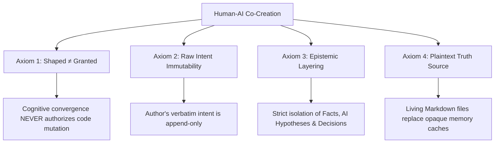
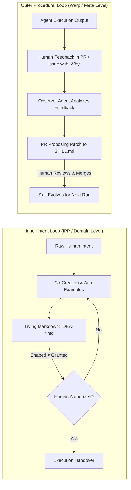

<div align="center">

# 📜 Intent-Preserving Protocol (IPP)

**An open architectural specification and operational constitution for preventing stateless context dissipation and hyperactive over-reach in Agentic AI.**

[](SPEC.md)
[](LICENSE)
[](https://github.com/isdou/intent-preserving-protocol/discussions)
[](#-ipp-compliance-badge)

<br/>

[**Read Formal SPEC.md**](SPEC.md) • [**Reference Skills**](#-reference-implementations) • [**Design Philosophy**](#-why-ipp) • [**Contributing (RFCs)**](CONTRIBUTING.md)

</div>

---

## ⚡ The Problem: Two Systemic Agent Failures

As autonomous AI agents shift from passive conversational helpers to proactive execution engines, two critical failure modes dominate modern agentic workflows:

```
┌─────────────────────────────────────────────────────────────────────────────┐
│                       The Dual Failure Modes of Agents                      │
└─────────────────────────────────────────────────────────────────────────────┘
                                       │
            ┌──────────────────────────┴──────────────────────────┐
            ▼                                                     ▼
 1. Stateless Context Dissipation                      2. Hyperactive Over-reach
 • Session ends -> High-value rationale lost           • Exploratory reasoning mistaken for mandate
 • Vector memory lacks chronological logic            • Code modified without explicit permission
 • System prompt rewriting does not scale             • AI interpretations distort author intent
```

---

## 🏛️ The Intent Constitution (Four Core Axioms)

Any IPP-compliant system or agent runtime adheres to four foundational axioms:



### 1. `Shaped ≠ Granted` (The Execution Boundary)
* Reaching `status: shaped` (the idea is clear and bounded) **NEVER** grants `implementation_authorization: granted`.
* The agent is empowered to co-evolve and critique, but **never to unilaterally trigger tool mutations without an explicit human ignition command**.

### 2. Raw Intent Immutability
* The author's original words and stated motivations are the first-class origin of the collaboration.
* The agent may synthesize and derived trade-offs, but **must never silently overwrite or paraphrase the author's verbatim expressions**.

### 3. Explicit Epistemic Layering
* In every output and document update, the agent strictly separates **Author Directives**, **Ground Truth / Facts**, **AI Hypotheses**, and **Open Unknowns**.

### 4. Living Artifact as Single Source of Truth
* Ephemeral chat transcripts and vector-embedding memory layers are non-authoritative caches.
* The single source of truth is an auditable, human-and-agent-editable **Living Markdown** document (e.g., `IDEA-YYYYMMDD-<slug>.md`).

---

## 🔄 Dual-Loop Co-Evolution (DLCE)

IPP seamlessly complements procedural self-improving agent architectures (e.g., *Anthropic & Warp's Self-Improving Skills* model):



* **Inner Loop (Domain Level):** Preserves human intent, resolves ambiguity, and prevents unauthorized execution while shaping *what to build*.
* **Outer Loop (Meta Level):** Compounds human feedback into file-based Skill definitions, refining *how the agent operates*.

---

## 📊 Comparison Matrix

| Dimension | Raw Chat / Prompting | Vector Memory (RAG / Mem0) | Intent-Preserving Protocol (IPP) |
| :--- | :--- | :--- | :--- |
| **Context Lifespan** | Ephemeral (Lost on close) | Persistent (Fragmented chunks) | **Durable Living Markdown (Single Truth)** |
| **Decision Traceability** | ❌ None | ❌ Low (Opaque embeddings) | **✅ 100% (Append-only Changelog & Trail)** |
| **Execution Safety** | ⚠️ High Risk (Prompt drift) | ⚠️ High Risk (Agent over-reach) | **🛡️ Guaranteed (`Shaped ≠ Granted` Constitution)** |
| **Intent Fidelity** | ❌ Distorted by AI | ⚠️ Partial retrieval | **✅ Immutable Raw Quotes + Explicit Assumptions** |
| **Auditability** | ❌ Impossible | ❌ Black-box DB query | **✅ Native Git Diff & PR Review** |

---

## 🛠 Reference Implementations

The following open-source projects implement the Intent-Preserving Protocol:

* **[`isdou/i-have-an-idea-skill`](https://github.com/isdou/i-have-an-idea-skill):** Conversational idea capturing and intent preservation skill for Claude Code, Codex, and Antigravity.
* **[`isdou/branch-keeper`](https://github.com/isdou/branch-keeper):** Local-first decision branch preservation and resuming plugin for product workflows.

---

## 🏷️ IPP Compliance Badge

If your agent tool, skill, or framework implements the Intent-Preserving Protocol, add this badge to your `README.md`:

```markdown
[](https://github.com/isdou/intent-preserving-protocol)
```

Preview:  
[](https://github.com/isdou/intent-preserving-protocol)

---

## 🤝 Contributing & RFCs

We welcome contributions! Whether proposing new axioms, extending the Living Document schema, or submitting reference implementations:

1. Read the full [**`SPEC.md`**](SPEC.md).
2. Open an [**RFC (Request for Comments)**](https://github.com/isdou/intent-preserving-protocol/issues/new?template=rfc-proposal.md) in Issues or start a [GitHub Discussion](https://github.com/isdou/intent-preserving-protocol/discussions).
3. Review our [**`CONTRIBUTING.md`**](CONTRIBUTING.md).

---

## 📄 License

MIT © [isdou](https://github.com/isdou)
