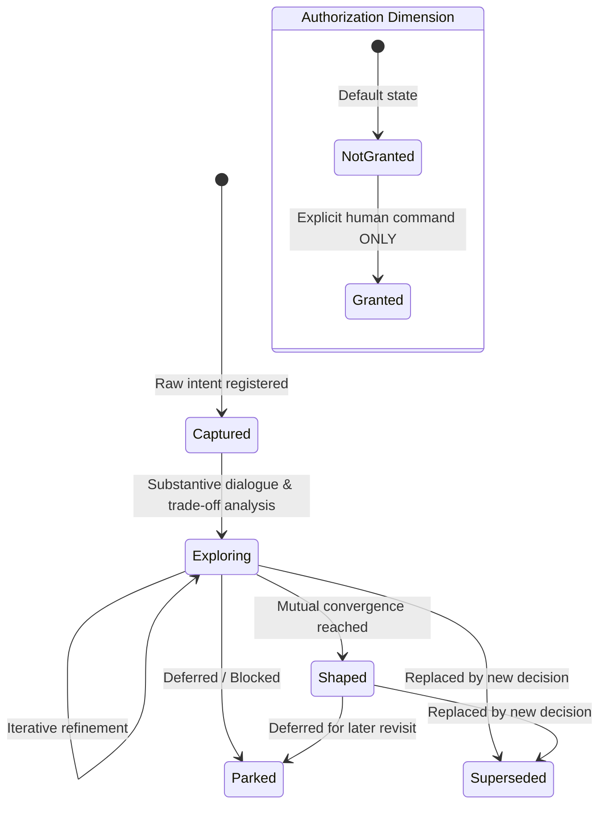

# Intent-Preserving Protocol (IPP) Specification

**Version:** `1.0.0`  
**Status:** Draft / Reference Specification  
**Author:** [isdou (@isdou)](https://github.com/isdou)  
**Category:** Agent Architecture & Human-AI Collaboration  

---

## 1. Abstract

As autonomous AI agents shift from passive conversational assistants to proactive execution engines, two critical systemic failures emerge:
1. **Stateless Context Dissipation:** Crucial human intent, negative constraints, and evolutionary rationale vanish when a chat session terminates.
2. **Hyperactive Over-reach (Unauthorized Execution):** Generative agents conflate *exploratory reasoning* with *execution mandate*, frequently mutating production codebases or initiating workflows without explicit human authorization.

The **Intent-Preserving Protocol (IPP)** is a formal design specification and operational contract for agentic systems. It decouples **cognitive convergence** (refining an idea or decision) from **operational execution** (modifying code or triggering tools), anchoring the evolving collaboration into version-controlled, auditable, plaintext **Living Artifacts**.

---

## 2. Core Axioms (The Intent Constitution)

Any IPP-compliant system MUST adhere to four fundamental axioms:

```
                          ┌──────────────────────────────────────────────┐
                          │         The Intent Constitution (IPP)        │
                          └──────────────────────────────────────────────┘
                                                  │
                 ┌────────────────────────────────┴────────────────────────────────┐
                 ▼                                                                 ▼
   【Axiom 1: Shaped ≠ Granted】                                     【Axiom 2: Intent Immutability】
  Cognitive convergence does NOT imply                              Author's raw phrasing is append-only;
     operational authorization.                                       AI interpretations cannot overwrite.
                 │                                                                 │
                 ▼                                                                 ▼
   【Axiom 3: Epistemic Layering】                                    【Axiom 4: Plaintext Truth Source】
   Facts, AI assumptions, and user                                   A living Markdown file is the sole
     decisions must remain distinct.                                    source of truth over chat memory.
```

### Axiom 1: Decoupling of Maturity and Authorization (`Shaped ≠ Granted`)
* A state transition to `status: shaped` indicates that an idea, spec, or architecture has achieved clarity and mutual alignment.
* **`status: shaped` NEVER grants `implementation_authorization: granted`.**
* Execution mandates MUST be explicitly, unambiguously, and independently authorized by the human author (e.g., "Authorize execution", "Start implementation").
* Without explicit authorization, the agent's legitimate outputs are restricted strictly to artifact creation/updates and conversational clarification.

### Axiom 2: Raw Intent Immutability
* The author's original words and stated motivations are the first-class origin of the collaboration.
* The agent MAY synthesize, critique, suggest counter-examples, and derive trade-offs, but MUST NOT overwrite or silently paraphrase the author's verbatim expressions.
* Historical pivots MUST be preserved with explicit superseded markings rather than rewritten into retrospective false consensus.

### Axiom 3: Explicit Epistemic Layering
In every living record and message output, the agent MUST rigorously distinguish between:
1. **Author Intent:** Explicit directives or preferences expressed by the human.
2. **Ground Truth / Facts:** Verified codebase realities, architectural constraints, or documented invariants.
3. **AI Hypotheses & Judgments:** Inferred requirements, proposed alternatives, or speculative risks.
4. **Open Unknowns:** Unresolved trade-offs awaiting human arbitration.

### Axiom 4: Plaintext Living Artifact as Single Source of Truth
* Ephemeral chat transcripts and vector-embedding memory layers are non-authoritative caches.
* The single source of truth for an evolving intent MUST be an inspectable, human-and-agent-editable Markdown document (e.g., `IDEA-YYYYMMDD-<slug>.md`).

---

## 3. State Machine & Lifecycle Model

An IPP session tracks two independent orthogonal state dimensions: **Lifecycle Status** and **Execution Authorization**.



### 3.1 Lifecycle States
- **`captured`**: Initial receipt of raw intent. No deep exploration has occurred.
- **`exploring`**: Active dialogue refining requirements, analyzing trade-offs, and probing edge cases.
- **`shaped`**: The idea is structurally complete, bounded, and verified by the author.
- **`parked`**: Temporarily frozen with an explicit `why_not_now` rationale and `revisit_trigger`.
- **`superseded`**: Overridden by an alternative direction with bi-directional references preserved.

### 3.2 Authorization States
- **`not-granted` (Default)**: Strict read/co-author mode. Code mutations, tool execution, and deployment hooks are forbidden.
- **`granted`**: Execution unlocked for the *specific bounded scope* of the shaped document only. Authorization does NOT propagate to other artifacts.

---

## 4. Living Artifact Document Schema

Every IPP artifact MUST implement the 5-Section Living Schema:

```markdown
---
id: IDEA-20260828-agent-intent-protocol
title: "Intent-Preserving Protocol"
status: shaped               # captured | exploring | shaped | parked | superseded
implementation_authorization: not-granted  # not-granted | granted
version: 1.0.0
created_at: 2026-08-28T12:00:00Z
updated_at: 2026-08-28T13:45:00Z
---

# [Title]

> [Current One-Line Definition]

## 1. Current Shape (当前形态)
- **Core Value:** Concise summary of what is being achieved.
- **Recommended Approach:** The current architectural direction.
- **Scope & Non-Goals:** Explicit boundaries.

## 2. Origin & Raw Intent (起因与作者原话)
- Verbatim quotes from the human author detailing the original motivation.

## 3. Evolution, Decisions & Boundaries (演进、决定与边界)
- Chronological decision trail.
- Rejected alternatives and trade-off rationales.
- Superseded choices with linked reasons.

## 4. Open Questions & Assumptions (未决问题与假设)
- [ ] Explicit unknowns requiring validation.
- AI inferences clearly tagged as `[Assumption]` or `[Hypothesis]`.

## 5. Changelog (版本记录)
- Append-only version history documenting structural leaps in mutual understanding.
```

---

## 5. Dual-Loop Co-Evolution (DLCE) Integration

IPP integrates cleanly with procedural self-improving agents (e.g., Anthropic & Warp's *Self-Improving Skills* architecture) by establishing a two-tier co-evolution model:

```
┌─────────────────────────────────────────────────────────────────────────────┐
│                    Dual-Loop Co-Evolution Model (DLCE)                      │
└─────────────────────────────────────────────────────────────────────────────┘
                                       │
            ┌──────────────────────────┴──────────────────────────┐
            ▼                                                     ▼
   【Inner Intent Loop (IPP)】                            【Outer Procedural Loop (Warp)】
   Target: Domain Problem & Product Ideas                 Target: Agent Rules & Operational Skills
   Artifact: `docs/ideas/IDEA-*.md`                       Artifact: `.agents/skills/*/SKILL.md`
   Engine: Real-time Human-AI dialogue                    Engine: Scheduled Observer Agent + PRs
   Governing Rule: `Shaped != Granted`                    Governing Rule: Human Code Review & Merge
```

- **Inner Intent Loop (Domain Level):** Preserves human intent, resolves ambiguity, and prevents unauthorized execution while shaping what to build.
- **Outer Procedural Loop (Meta Level):** Compounds human feedback (via PR comments/reviews) into file-based Skill definitions, refining how the agent operates.

---

## 6. Reference Implementations

1. **[`isdou/i-have-an-idea-skill`](https://github.com/isdou/i-have-an-idea-skill):** Production reference implementation for conversational idea capturing and intent preservation.
2. **[`isdou/branch-keeper`](https://github.com/isdou/branch-keeper):** Local-first decision branch management for deferred trajectories across Codex and Antigravity.

---

## 7. License

Licensed under the [MIT License](LICENSE).
